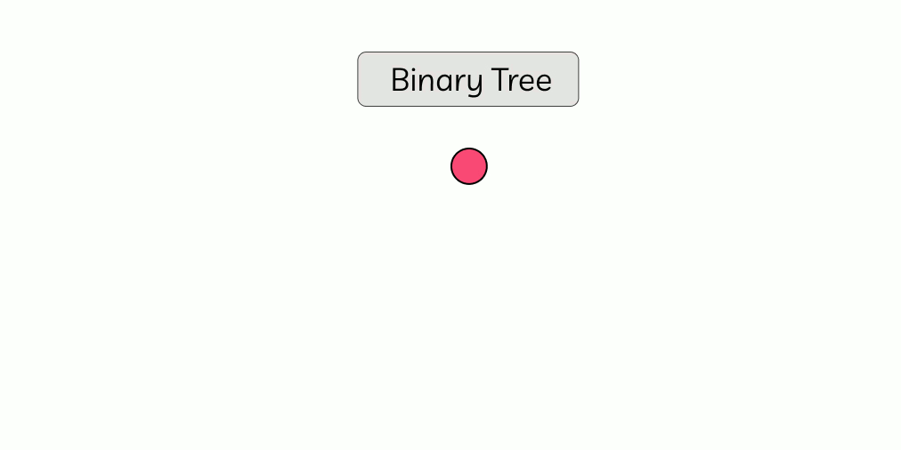
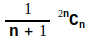

# Binary Tree and Its Types

A Binary Tree is a subset of a general tree data structure having the degree of two. That means a binary tree can have at most two children of any given node. The above figure is an example of a binary tree. From the applied computer science perspective, in pretty much every real-life use case, binary trees are frequently used.

 
 

**Properties:**

1. The maximum number of possible nodes in a binary tree of height **h** is **2ʰ - 1**.
1. The minimum number of possible nodes in a binary tree is **h** whereas, **h** is the height of that tree.
1. The maximum number of possible nodes on level **l** of a binary tree is **2ˡ**, whereas **l ≥ 0**.
1. The relation between the number of nodes, **n**, and edges, **e** is **n = e + 1**.
1. The total number of binary trees possible with **n** number of nodes is:

